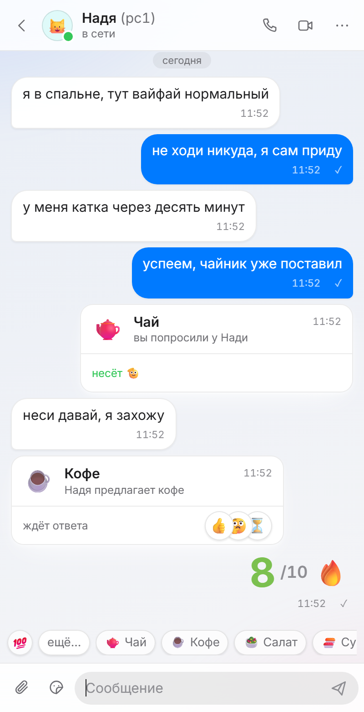
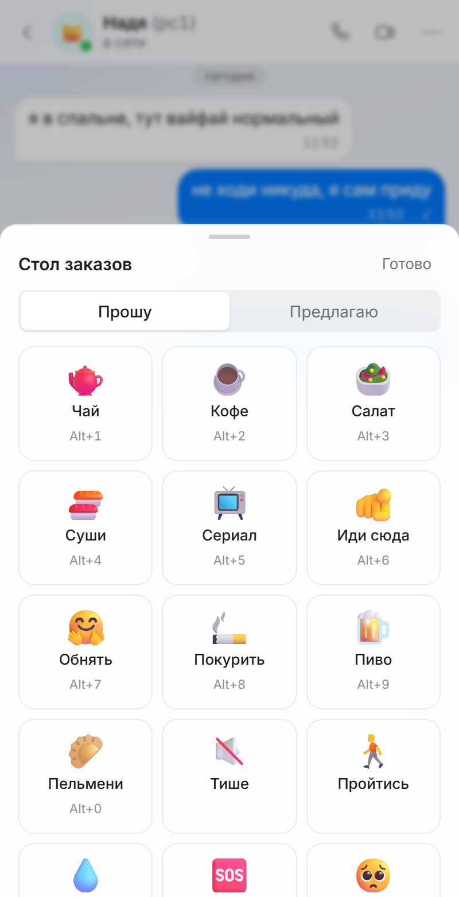
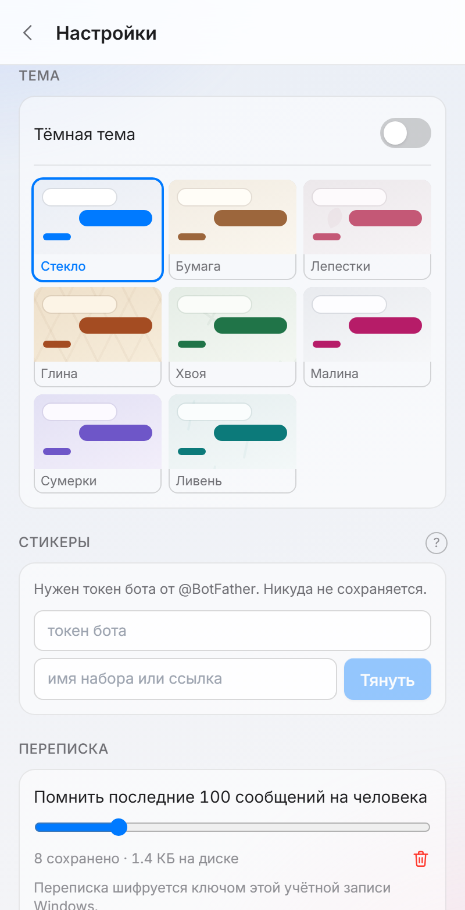

# Nearby · Рядом

**A local chat for your home network — no internet, no accounts, no server.**

[**Website**](https://nearby.manacode.su/en/) · [**Сайт**](https://nearby.manacode.su/) · [**Download**](https://github.com/dmitriinosach/Nearby-Lan-Chat/releases/latest) · [Discord](https://discord.gg/6gW75qKbcW)

  <table>
    <tr>
      <td></td>
      <td></td>
      <td></td>
    </tr>
  </table>

---

## What is it

**Nearby** is a tiny chat for two or three computers in one home. It links the machines
directly over your local network — through your Wi-Fi router or a cable — so there is
**no internet, no accounts and no server in the middle.** Launch it on both PCs and they
find each other on the network within seconds. Nothing to configure.

It grew out of one idea: the message you actually send between two desks forty times a day
is not a paragraph — it's *"tea?"*. So the middle of the chat is an **order table**: tap a
card, the other side answers with a single button.

## What it does

- 💬 **Local chat** over your LAN — no setup, machines appear in the list on their own.
- 📎 **File transfer**, PC to PC directly, any size — no cloud, no size cap from your uplink.
- 📞 **Voice & video call** straight between two windows.
- 🖥️ **Screen share** — the whole desktop or a single window, separate from the call.
- 🫡 **Reactions & orders** — offer coffee, call someone into a game, answer with one emoji.
- 🔒 **Always encrypted** between machines; history on disk can be password-locked.
- 🎨 **Eight themes**, light and dark each, or your own photo as the background.

## Download

**[Grab the latest release for Windows →](https://github.com/dmitriinosach/Nearby-Lan-Chat/releases/latest)**

One `.exe`, about 11 MB. No installer required — run it on both machines and start typing.
Works on Windows 10 and 11.

## Privacy

Nearby works **without the internet** and **collects nothing about you**. There are no
accounts, no telemetry and no cloud. Traffic between computers is encrypted and cannot be
turned off. Your conversations never leave your local network.

## Feedback

- 🐞 Found a bug or have an idea? [**Open an issue**](https://github.com/dmitriinosach/Nearby-Lan-Chat/issues/new/choose).
- 💬 Just want to ask or hang out? [**Join the Discord**](https://discord.gg/6gW75qKbcW).

The **"Report a problem"** button inside the app also collects version and log details for you.

---

<h2>🇷🇺 По-русски</h2>

**«Рядом»** — маленький чат для двух-трёх компьютеров в одной квартире. Связывает машины
напрямую через локальную сеть (Wi-Fi роутер или кабель): **без интернета, без аккаунтов,
без сервера.** Запустите на обоих ПК — они найдут друг друга за пару секунд, настраивать
нечего.

В середине чата — **стол заказов**: сообщение, которое реально шлёшь между столами сорок
раз в день, это не абзац, а *«чай?»*. Тыкаете карточку — на той стороне отвечают одной
кнопкой.

**Что умеет:** локальный чат по сети · передача файлов с ПК на ПК любого размера · звонок
с голосом и видео · демонстрация экрана · реакции и заказы · шифрование между машинами ·
пароль на историю · восемь тем.

**[Скачать для Windows →](https://github.com/dmitriinosach/Nearby-Lan-Chat/releases/latest)** —
один файл ~11 МБ, установка не нужна. Windows 10 и 11.

**Приватность:** работает без интернета и не собирает о вас ничего. Ни аккаунтов, ни
телеметрии, ни облака. Переписка между компьютерами зашифрована и не покидает вашу сеть.

**Обратная связь:** [issue на GitHub](https://github.com/dmitriinosach/Nearby-Lan-Chat/issues/new/choose)
· [Discord](https://discord.gg/6gW75qKbcW) · кнопка «Сообщить об ошибке» в самом приложении.

Сайт: [nearby.manacode.su](https://nearby.manacode.su/) · Автор: [Dmitrii Nosach](https://github.com/dmitriinosach) · Проекты: [manacode.su](https://manacode.su)

